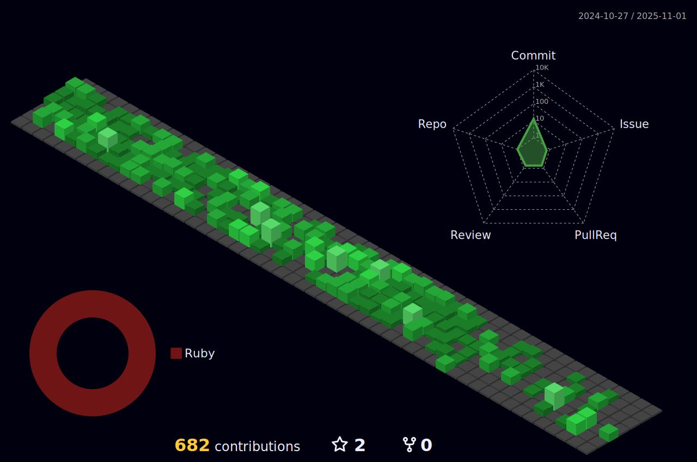

Hi My name is Rukesh Basukala
=======================================================================================================================================
Rails Developer

# <b>About me</b> <picture></picture>
 

I am a competent young, energetic, and passionate programmer with more than 1 year of experience in different stacks.
* 🌍  I'm based in Bhaktapur Nepal
* 🖥️  See my portfolio at [RukeshB](http://portfolio.rukeshb.com.np/)
* ✉️  You can contact me at [rukeshbasukala@gmail.com](mailto:rukeshbasukala@gmail.com)
* 🚀  I'm currently working on [fleetpanda](https://www.fleetpanda.com/)
* 🧠  I'm learning React
* 🤝  I'm open to collaborating on interesting projects

 

<b> Skills</b> 

<h3>LANGUAGES</h3>

    

<h3>Hosting/SaaS</h3>

   

<h3>FRAMEWORKS</h3>

  

<h3>DATABASES</h3>

   

<h3>DESIGN</h3>

   

<h3>OTHER</h3>

 

 

<b> Github Stats </b> 

<picture>
  <source media="(prefers-color-scheme: dark)" srcset="https://raw.githubusercontent.com/RukeshB/RukeshB/output/github-contribution-grid-snake-dark.svg">
  <source media="(prefers-color-scheme: light)" srcset="https://raw.githubusercontent.com/RukeshB/RukeshB/output/github-contribution-grid-snake.svg">
  
</picture>

## <b> Let's Connect..!</b> 

 <a href="https://www.codepen.io/RukeshB" target="_blank" rel="noreferrer"> <picture> <source media="(prefers-color-scheme: dark)" srcset="https://raw.githubusercontent.com/danielcranney/readme-generator/main/public/icons/socials/codepen-dark.svg" /> <source media="(prefers-color-scheme: light)" srcset="https://raw.githubusercontent.com/danielcranney/readme-generator/main/public/icons/socials/codepen.svg" />  </picture> </a> <a href="https://www.dev.to/rukeshb" target="_blank" rel="noreferrer"> <picture> <source media="(prefers-color-scheme: dark)" srcset="https://raw.githubusercontent.com/danielcranney/readme-generator/main/public/icons/socials/devdotto-dark.svg" /> <source media="(prefers-color-scheme: light)" srcset="https://raw.githubusercontent.com/danielcranney/readme-generator/main/public/icons/socials/devdotto.svg" />  </picture> </a> <a href="https://discord.com/users/484405236614823938" target="_blank" rel="noreferrer"> <picture> <source media="(prefers-color-scheme: dark)" srcset="undefined" /> <source media="(prefers-color-scheme: light)" srcset="https://raw.githubusercontent.com/danielcranney/readme-generator/main/public/icons/socials/discord.svg" />  </picture> </a> <a href="https://www.facebook.com/rukesh.basukala.9/" target="_blank" rel="noreferrer"> <picture> <source media="(prefers-color-scheme: dark)" srcset="https://raw.githubusercontent.com/danielcranney/readme-generator/main/public/icons/socials/facebook-dark.svg" /> <source media="(prefers-color-scheme: light)" srcset="https://raw.githubusercontent.com/danielcranney/readme-generator/main/public/icons/socials/facebook.svg" />  </picture> </a> <a href="https://www.github.com/RukeshB" target="_blank" rel="noreferrer"> <picture> <source media="(prefers-color-scheme: dark)" srcset="https://raw.githubusercontent.com/danielcranney/readme-generator/main/public/icons/socials/github-dark.svg" /> <source media="(prefers-color-scheme: light)" srcset="https://raw.githubusercontent.com/danielcranney/readme-generator/main/public/icons/socials/github.svg" />  </picture> </a> <a href="https://www.linkedin.com/in/rukesh-basukala-849042197/" target="_blank" rel="noreferrer"> <picture> <source media="(prefers-color-scheme: dark)" srcset="https://raw.githubusercontent.com/danielcranney/readme-generator/main/public/icons/socials/linkedin-dark.svg" /> <source media="(prefers-color-scheme: light)" srcset="https://raw.githubusercontent.com/danielcranney/readme-generator/main/public/icons/socials/linkedin.svg" />  </picture> </a>

<!--  -->
